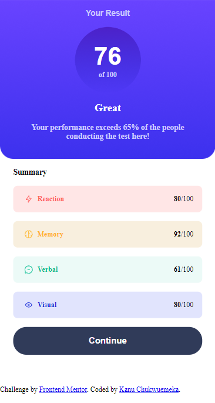
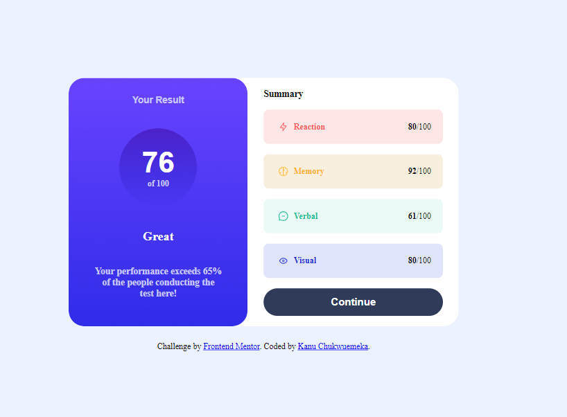

# Frontend Mentor - Results summary component solution

This is a solution to the [Results summary component challenge on Frontend Mentor](https://www.frontendmentor.io/challenges/results-summary-component-CE_K6s0maV). Frontend Mentor challenges help you improve your coding skills by building realistic projects. 

## Table of contents

- [Overview](#overview)
  - [The challenge](#the-challenge)
  - [Screenshot](#screenshot)
  - [Links](#links)
- [My process](#my-process)
  - [Built with](#built-with)
  - [What I learned](#what-i-learned)
  - [Continued development](#continued-development)
  - [Useful resources](#useful-resources)
- [Author](#author)
- [Acknowledgments](#acknowledgments)

## Overview

### The challenge

Users should be able to:

- View the optimal layout for the interface depending on their device's screen size
- See hover and focus states for all interactive elements on the page
- **Bonus**: Use the local JSON data to dynamically populate the content

### Screenshot




Add a screenshot of your solution. The easiest way to do this is to use Firefox to view your project, right-click the page and select "Take a Screenshot". You can choose either a full-height screenshot or a cropped one based on how long the page is. If it's very long, it might be best to crop it.

Alternatively, you can use a tool like [FireShot](https://getfireshot.com/) to take the screenshot. FireShot has a free option, so you don't need to purchase it. 

Then crop/optimize/edit your image however you like, add it to your project, and update the file path in the image above.

**Note: Delete this note and the paragraphs above when you add your screenshot. If you prefer not to add a screenshot, feel free to remove this entire section.**

### Links

- Solution URL: [Github](https://github.com/Mekuseo/results-summary-component-main)
- Live Site URL: [site-url](https://mekuseo.github.io/results-summary-component-main/)

## My process

### Built with

- Semantic HTML5 markup
- CSS custom properties
- Flexbox
- Mobile-first workflow
- Javascript

### What I learned

I have learnt to dynamically populate contents from a local json using fetch

```js
fetch('data.json')
  .then(response => response.json())
  .then(data => {

    const scoreContainer = document.getElementById('score-container');
    
    data.forEach(item => {
      const scoreCard = document.createElement('div');
      scoreCard.className = 'score-card ' + item.category.toLowerCase() + 'Background';
      
      const cardContent = `
        <div>
          
          <p class="${item.category.toLowerCase()}">${item.category}</p>
        </div>
        <div>
          <p class="scorePoints"><span>${item.score}</span>/100</p>
        </div>
      `;
      scoreCard.innerHTML = cardContent;
      scoreContainer.appendChild(scoreCard);
    });
  })
  .catch(error => {
    console.error('Error fetching data:', error);
  });
```

### Continued development

- Learn more on DOM manipulation

### Useful resources

- Chatgpt

## Author

- Website - [Kanu Chukwuemeka](https://my-portfolio-86ro.onrender.com/)
- Frontend Mentor - [@Mekuseo](https://www.frontendmentor.io/profile/yourusername)
- Twitter - [@fullstack_pison](https://twitter.com/Fullstack_pison)


## Acknowledgments

This is where you can give a hat tip to anyone who helped you out on this project. Perhaps you worked in a team or got some inspiration from someone else's solution. This is the perfect place to give them some credit.

**Note: Delete this note and edit this section's content as necessary. If you completed this challenge by yourself, feel free to delete this section entirely.**
